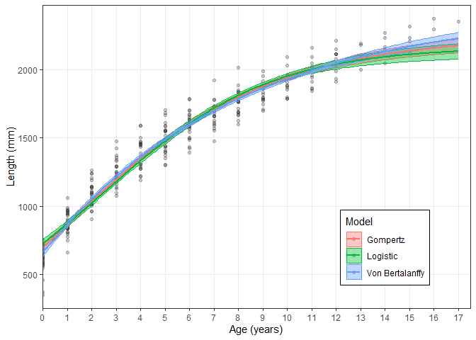

<!-- README.md is generated from README.Rmd. Please edit that file -->

# AquaticLifeHistory

<!-- badges: start -->

[](https://travis-ci.org/jonathansmart/AquaticLifeHistory)
[](https://zenodo.org/badge/latestdoi/223704049)
<!-- badges: end -->

AquaticLifeHistory allows users to undertake fisheries life history
analyses using contemporary approaches as simple R functions. These
analyses currently include length-at-age modelling using a multi-model
approach, estimating age-at-maturity and length-at-maturity. The main
package functions are:

  - `Estimate_Growth()` performs length-at-age analyses using a von
    Bertalanffy growth model, Gompertz model and/or Logistic model.
  - `Estimate_Age_Maturity()` Estimates age-at-maturity using either
    binomial maturity or proportion mature data and age.
  - `Estimate_Len_Maturity()` Estimates age-at-maturity using either
    binomial maturity or proportion mature data and length.

## Installation

You can install the released version of AquaticLifeHistory from
[Github](https://github.com/jonathansmart/AquaticLifeHistory) with:

``` r
# install.packages("devtools")
devtools::install_github("jonathansmart/AquaticLifeHistory")
```

## Usage

\#\#\#Perform growth analysis

``` r
library(AquaticLifeHistory)

# load example dataset
data("growth_data")

# Run fuction with three default model candidates.
# Model parameters, AIC values are returned and a plot with bootstrapped CI's is printed to examine fits.
Estimate_Growth(growth_data)
```

<!-- -->

    #> $VonB
    #>         Parameter           SE
    #> Linf 2439.5652152 50.416333174
    #> k       0.1253499  0.006938586
    #> L0    659.2971932 14.318722941
    #> RSE    97.9461196           NA
    #> 
    #> $Logistic
    #>         Parameter          SE
    #> Linf 2163.8640322 26.46867899
    #> g       0.2894532  0.01039625
    #> L0    727.0885241 13.58771361
    #> RSE   110.3850532          NA
    #> 
    #> $Gompertz
    #>        Parameter           SE
    #> Linf 2250.137001 32.621706468
    #> g       0.207524  0.008455424
    #> L0    695.603479 13.779414030
    #> RSE   103.855273           NA
    #> 
    #> $AIC
    #>   Model    AICc AIC diff Weight
    #> 1    VB 3535.10     0.00      1
    #> 2   Log 3605.40    70.30      0
    #> 3   Gom 3569.54    34.45      0

\#\#\#Perform age-at-maturity analysis

``` r
# load example dataset
data("maturity_data")

# Run fuction to estimate age-at-maturity parameters
Estimate_Age_Maturity(maturity_data)
#>     Estimate        SE
#> A50 13.95113 0.3033328
#> A95 16.53427 0.5321205

# A plot can also be returned with bootstrapped CI's.
Estimate_Age_Maturity(maturity_data, return = "plot")
```

<!-- -->

For further examples of these and other functions use the provided
vignettes

``` r
browseVignettes("AquaticLifeHistory")
```
